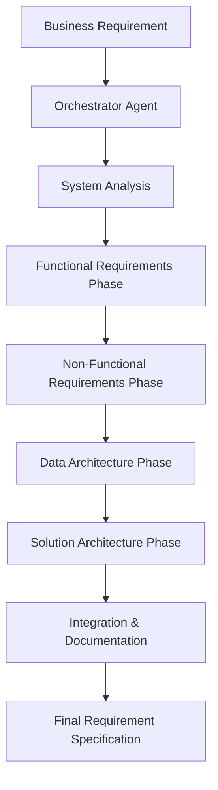

# CLAUDE.md

This file provides guidance to Claude Code (claude.ai/code) when working with code in this repository.

## Conversation Guidelines
- 常に日本語で会話する

## Commands

### Development
- **Install dependencies**: `uv sync`
- **Run tests**: `pytest` (configured with coverage reporting)
- **Lint code**: `ruff check src tests`
- **Format code**: `ruff format src tests`
- **Run single test**: `pytest tests/path/to/test_*.py::TestClass::test_method`

### Application Entry Points
- **Business requirement agent**: `biz-requirement-agent` (via pyproject.toml script)
- **Task management agents**: `task-management-agents` (via pyproject.toml script)

## Architecture

### Core Framework
This project uses **LangGraph** for building AI agent workflows with state management. All agents extend the `AgentGraphBuilder` abstract base class located in `src/agents/core/agent_builder.py`.

### Agent Structure
- **State Management**: Uses Pydantic models for type-safe state handling
- **Graph Building**: Each agent implements `build_graph()` returning a `CompiledGraph`
- **Visualization**: Built-in `draw_mermaid_graph()` method for workflow visualization

### Business Requirement Agent
Located in `src/agents/biz_requirement/`, this agent follows a multi-phase workflow:
1. **Introduction**: Initial user greeting and setup
2. **Interview**: Interactive requirements gathering using predefined question templates
3. **Outline Generation**: Dynamic document structure creation
4. **Detail Generation**: Parallel content generation for each section
5. **Document Integration**: Final markdown document assembly

Key features:
- Non-technical user-friendly question templates in `QUESTION_TEMPLATES`
- Mandatory vs optional requirement fields (`MANDATORY`/`OPTIONAL`)
- Specialized schemas for business requirements in `schemas.py`
- Output documents saved to `outputs/` directory

### Requirement Process Agent System
Located in `src/agents/requirement_process/`, this comprehensive system transforms business requirements into detailed technical specifications through a multi-agent orchestration workflow.

#### Architecture Overview
- **Orchestrator Agent**: Manages the overall workflow and coordinates between persona agents
- **6 Specialized Persona Agents**: Each handles specific aspects of requirement analysis
- **State Management**: Uses `RequirementProcessState` for workflow coordination
- **Output Integration**: Consolidates all agent outputs into a unified requirement specification

#### Persona Agents
1. **System Analyst Agent** (`system_analyst.py`)
   - Analyzes business requirements and identifies functional candidates
   - Outputs: Functional requirement list with priorities

2. **UX Designer Agent** (`ux_designer.py`)
   - Creates user stories and interaction designs
   - Outputs: User stories, acceptance criteria, UI/UX specifications

3. **QA Engineer Agent** (`qa_engineer.py`)
   - Defines test strategies and quality standards
   - Outputs: Test plans, quality metrics, acceptance criteria

4. **Infrastructure Engineer Agent** (`infrastructure_engineer.py`)
   - Specifies infrastructure and deployment requirements
   - Outputs: Infrastructure architecture, deployment strategies

5. **Security Specialist Agent** (`security_specialist.py`)
   - Analyzes security requirements and defines security controls
   - Outputs: Security requirements, threat analysis, compliance guidelines

6. **Data Architect Agent** (`data_architect.py`)
   - Designs data models and database structures
   - Outputs: Data models, database schemas, data flow diagrams

7. **Solution Architect Agent** (`solution_architect.py`)
   - Consolidates all requirements into system architecture
   - Outputs: System architecture, technology stack recommendations

#### Workflow Process


#### Key Features
- **Sequential Processing**: Each phase builds upon previous outputs
- **Parallel Execution**: Multiple agents work simultaneously where appropriate
- **Quality Validation**: Each agent validates inputs and outputs
- **Comprehensive Testing**: 54 tests with 78% coverage
- **Schema Compatibility**: Seamless integration with Business Requirement Agent via `ProjectBusinessRequirement`

### Configuration
- Environment variables managed through `src/common/config.py` using Pydantic Settings
- Supports Google GenAI, OpenAI, LangSmith, and Tavily API keys
- JSON logging format via `src/utils/logger.py`

### MCP (Model Context Protocol) Integration
- **MCP Configuration**: `.mcp.json` file configures MCP servers for enhanced functionality
- **LangSmith MCP Server**: Provides tracing, monitoring, and dataset management capabilities
  - Command: `uvx langsmith-mcp-server`
  - Requires `LANGSMITH_API_KEY` environment variable
- **GitHub MCP Server**: Enables direct GitHub operations via Docker
  - Command: `docker run ghcr.io/github/github-mcp-server`
  - Requires `GITHUB_PERSONAL_ACCESS_TOKEN` environment variable
  - **IMPORTANT**: All GitHub operations (PR creation, issue management, repository operations, etc.) should use the GitHub MCP Server instead of CLI commands
- **LangSmith Integration**: Automatic trace logging and project monitoring for agent workflows

### Testing
- Uses pytest with async support and coverage reporting
- Tests located in `tests/` directory matching source structure
- Test configuration in `pyproject.toml` includes `pythonpath = "./src"`
- **Current Coverage**: 54 tests with 78% code coverage
- **Test Structure**:
  - `tests/agents/biz_requirement/` - Business requirement agent tests
  - `tests/agents/requirement_process/` - Requirement process system tests
    - `test_integration.py` - Integration and workflow tests
    - `test_orchestrator.py` - Orchestrator agent tests
    - `test_persona_agents.py` - Individual persona agent tests

### Code Style
- Ruff for linting and formatting (line length: 135)
- Single quotes preferred for strings
- Space indentation
- Specific lint rules configured (excludes F401, E501, S101)

## Development Philosophy

### Test-Driven Development (TDD)
- 原則としてテスト駆動開発（TDD）で進める
- 期待される入出力に基づき、まずテストを作成する
- 実装コードは書かず、テストのみを用意する
- テストを実行し、失敗を確認する
- テストが正しいことを確認できた段階でコミットする
- その後、テストをパスさせる実装を進める
- 実装中はテストを変更せず、コードを修正し続ける
- すべてのテストが通過するまで繰り返す

### Pre-commit Requirements
- **MANDATORY**: コミット前に必ずテストとリントを実行する
  - `pytest` - すべてのテストが通過することを確認
  - `ruff check src tests` - リント検査をパス
  - `ruff format src tests` - コードフォーマットを適用
- テストまたはリントが失敗した場合は、修正してから再実行
- すべてのチェックが通過した後にのみコミットを行う

## Usage Examples

### Individual Agent Execution
```bash
# Business requirement collection
biz-requirement-agent

# Technical requirement specification
task-management-agents
```

### Integrated Workflow (Future Enhancement)
```bash
# Proposed unified workflow (Issue #15)
integrated-workflow-agent
```

### Development Commands
```bash
# Run all tests
pytest

# Run specific test suite
pytest tests/agents/requirement_process/

# Check code quality
ruff check src tests
ruff format src tests
```

## Recent Implementation History

### GitHub Issue #14 - Requirement Process Agent System (✅ Completed)
- **Implementation Date**: 2025-06-23
- **Commit**: c1c54f9
- **Key Achievements**:
  - Complete 6-persona agent system implementation
  - Orchestrator agent with workflow management
  - 54 comprehensive tests with 78% coverage
  - Schema integration with existing business requirement agent
  - LangGraph-based state management and parallel processing

### GitHub Issue #15 - Integrated Workflow (🚧 Proposed)
- **Objective**: Seamless user experience with single-command execution
- **Scope**: Combine biz-requirement-agent and task-management-agents
- **Benefits**: Enhanced UX, automated data flow, unified error handling

## File Structure Reference

```
src/agents/
├── core/
│   └── agent_builder.py          # Base class for all agents
├── biz_requirement/               # Business requirement collection
│   ├── biz_requirement_agent.py
│   └── schemas.py
└── requirement_process/           # Technical specification generation
    ├── main.py                    # Entry point
    ├── orchestrator/
    │   └── orchestrator_agent.py  # Workflow orchestration
    ├── personas/                  # 6 specialized agents
    │   ├── system_analyst.py
    │   ├── ux_designer.py
    │   ├── qa_engineer.py
    │   ├── infrastructure_engineer.py
    │   ├── security_specialist.py
    │   ├── data_architect.py
    │   └── solution_architect.py
    └── schemas.py                 # State management models
```

# important-instruction-reminders
Do what has been asked; nothing more, nothing less.
NEVER create files unless they're absolutely necessary for achieving your goal.
ALWAYS prefer editing an existing file to creating a new one.
NEVER proactively create documentation files (*.md) or README files. Only create documentation files if explicitly requested by the User.
