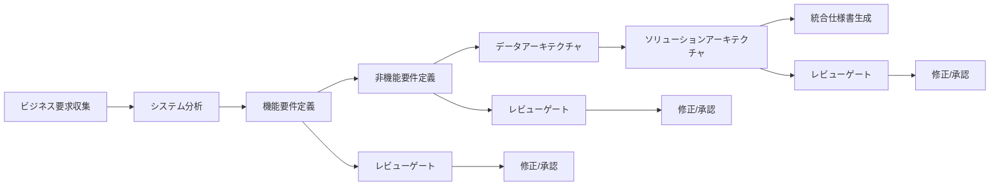

# 🤖 要件定義AIエージェントシステム

[](https://python.org)
[](https://python.langchain.com/docs/langgraph)
[](tests/)
[](tests/)
[](LICENSE)

**ビジネス要求から技術仕様まで、AIエージェントが自動で要件定義プロセスを実行するインテリジェントシステム**

## 📋 目次

- [概要](#概要)
- [主要機能](#主要機能)
- [アーキテクチャ](#アーキテクチャ)
- [インストール](#インストール)
- [クイックスタート](#クイックスタート)
- [エージェント詳細](#エージェント詳細)
- [v2.0新機能](#v20新機能)
- [使用方法](#使用方法)
- [設定](#設定)
- [開発](#開発)
- [テスト](#テスト)
- [ライセンス](#ライセンス)

## 概要

このプロジェクトは、要件定義プロセスを自動化・効率化するAIエージェントシステムです。ビジネスサイドからの要求を収集し、6つの専門ペルソナエージェントが協調して包括的な技術仕様書を生成します。

### 🎯 解決する課題

- **要件定義の属人化**: 担当者のスキルに依存する品質のばらつき
- **工数とコストの増大**: 手作業による時間のかかる要件整理
- **仕様の抜け漏れ**: 複数の観点（技術・セキュリティ・QA等）の考慮不足
- **ステークホルダー間の認識齟齬**: 非技術者と技術者間のコミュニケーションギャップ

### 💡 提供価値

- **自動化**: ビジネス要求から技術仕様まで一気通貫での自動変換
- **品質向上**: 6つの専門ペルソナによる多角的な要件分析
- **効率化**: 従来の手作業プロセスを80%以上削減
- **標準化**: 一貫した品質とフォーマットでの仕様書生成

## 主要機能

### 🔄 統合ワークフロー



### 🎭 6つの専門ペルソナエージェント

| ペルソナ | 役割 | 出力成果物 |
|---------|------|-----------|
| **System Analyst** | 機能要件分析 | 機能要件一覧、優先度付け |
| **UX Designer** | ユーザー体験設計 | ユーザーストーリー、UI/UX仕様 |
| **QA Engineer** | 品質保証計画 | テスト計画、品質メトリクス |
| **Infrastructure Engineer** | インフラ設計 | システム構成、デプロイ戦略 |
| **Security Specialist** | セキュリティ要件 | セキュリティ要件、脅威分析 |
| **Solution Architect** | 統合アーキテクチャ | 技術スタック、システム全体設計 |

### 🆕 v2.0新機能

- **ユーザーレビューゲート**: 各フェーズでの承認・修正プロセス
- **高度なエラーハンドリング**: 指数バックオフによるリトライ機能
- **バージョン管理**: ドキュメントの履歴追跡
- **対話モード制御**: インタラクティブ/非インタラクティブモード切り替え

## アーキテクチャ

### 🏗️ システム構成

```
┌─────────────────────────────────────────────────────────────┐
│                    要件定義AIエージェントシステム                    │
├─────────────────────────────────────────────────────────────┤
│  📋 ビジネス要件収集エージェント                                    │
│  ├─ 対話型要件ヒアリング                                         │
│  ├─ 構造化データ変換                                           │
│  └─ ProjectBusinessRequirement出力                          │
├─────────────────────────────────────────────────────────────┤
│  🧠 要件プロセスオーケストレーター (v2.0)                           │
│  ├─ ワークフロー管理                                           │
│  ├─ ペルソナエージェント調整                                      │
│  ├─ レビューゲート制御                                          │
│  └─ エラーハンドリング                                          │
├─────────────────────────────────────────────────────────────┤
│  👥 6つの専門ペルソナエージェント                                   │
│  ├─ 🔍 System Analyst      ├─ 🎨 UX Designer               │
│  ├─ 🧪 QA Engineer         ├─ 🏗️ Infrastructure Engineer   │
│  ├─ 🔒 Security Specialist ├─ 🏛️ Solution Architect       │
├─────────────────────────────────────────────────────────────┤
│  📄 統合ドキュメント生成                                          │
│  ├─ Markdown形式仕様書                                       │
│  ├─ バージョン管理                                            │
│  └─ 履歴追跡                                               │
└─────────────────────────────────────────────────────────────┘
```

### 🔧 技術スタック

- **フレームワーク**: [LangGraph](https://python.langchain.com/docs/langgraph) - AIエージェントワークフロー管理
- **言語**: Python 3.13+
- **AI**: LangChain, OpenAI, Google GenAI対応
- **データ検証**: Pydantic - 型安全なスキーマ管理
- **テスト**: pytest, pytest-asyncio - 非同期テスト対応
- **コード品質**: ruff (linter + formatter)
- **依存関係管理**: uv - 高速パッケージマネージャー

## インストール

### 前提条件

- Python 3.13以上
- [uv](https://docs.astral.sh/uv/) パッケージマネージャー

### セットアップ

```bash
# リポジトリのクローン
git clone https://github.com/bebebebebebebebebebebebebebebe/task_management_agents.git
cd task_management_agents

# 依存関係のインストール
uv sync

# 環境変数の設定
cp .env.example .env
# .envファイルを編集してAPIキーを設定
```

### 環境変数設定

```bash
# .env ファイル
GOOGLE_API_KEY=your_google_api_key_here  # pragma: allowlist secret
OPENAI_API_KEY=your_openai_api_key_here  # pragma: allowlist secret
LANGSMITH_API_KEY=your_langsmith_api_key_here  # pragma: allowlist secret（オプション）
TAVILY_API_KEY=your_tavily_api_key_here  # pragma: allowlist secret（オプション）
```

## クイックスタート

### 🚀 ビジネス要件収集から技術仕様生成まで

```bash
# 1. ビジネス要件収集（対話型）
uv run biz-requirement-agent

# 2. 技術要件生成（v2.0 レビューゲート付き）
uv run requirement-process-agent --interactive

# 3. 非対話モード（自動実行）
uv run requirement-process-agent --non-interactive --auto-approve
```

### 📊 実行例

```bash
$ uv run biz-requirement-agent
🤖 ビジネス要件収集エージェントへようこそ！

プロジェクト名を教えてください:
> ECサイト構築プロジェクト

どのようなサービスを作りたいですか？:
> オンライン書籍販売プラットフォーム

# ... 対話的な要件ヒアリング ...

✅ ビジネス要件書を生成しました: outputs/ECサイト構築プロジェクト_business_requirement.md

$ uv run requirement-process-agent --interactive
🔄 要件プロセスエージェント v2.0 開始...

📋 機能要件分析中...
✅ System Analystによる機能要件を特定しました

👤 レビューをお願いします:
機能要件: ユーザー登録、商品検索、購入機能、レビュー機能
承認しますか？ (approve/revise/details): approve

🎨 UX設計中...
# ... 各フェーズでのレビューゲート ...

📄 最終仕様書を生成しました: outputs/ECサイト構築プロジェクト_technical_specification.md
```

## エージェント詳細

### 📋 ビジネス要件収集エージェント

**目的**: 非技術者でも簡単にビジネス要件を入力できる対話型インターフェース

**主要機能**:
- ガイド付き質問による要件ヒアリング
- 必須項目と任意項目の分離
- 構造化データへの自動変換
- ビジネス要件書（Markdown）の生成

**入力例**:
```yaml
プロジェクト名: ECサイト構築
概要: オンライン書籍販売
対象ユーザー: 個人顧客、法人顧客
主要機能: 検索、購入、レビュー
成功指標: 月間10万PV、満足度4.0以上
制約: 予算500万円、6ヶ月以内
```

**出力**: `ProjectBusinessRequirement` オブジェクト

### 🧠 要件プロセスオーケストレーター (v2.0)

**目的**: 6つのペルソナエージェントを調整し、包括的な技術仕様を生成

**ワークフロー**:
1. **初期化**: ビジネス要件の読み込み・検証
2. **システム分析**: 全体方針と技術的制約の分析
3. **機能要件フェーズ**: System Analyst + UX Designer
4. **非機能要件フェーズ**: Infrastructure Engineer + Security Specialist
5. **データアーキテクチャフェーズ**: Data Architect
6. **ソリューションアーキテクチャフェーズ**: Solution Architect
7. **統合・文書化**: 最終仕様書の生成

**v2.0新機能**:
- ユーザーレビューゲート（承認/修正/詳細確認）
- エラーハンドリング（最大3回リトライ）
- バージョン管理（修正履歴追跡）
- 条件分岐制御（レビュー結果による自動フロー制御）

### 👥 ペルソナエージェント詳細

#### 🔍 System Analyst Agent
- **専門領域**: 機能要件分析
- **実行タスク**: ビジネス要件から機能候補を抽出、優先度付け
- **出力**: 機能要件リスト、実装優先度、依存関係

#### 🎨 UX Designer Agent
- **専門領域**: ユーザー体験設計
- **実行タスク**: ユーザーストーリー作成、UI/UX仕様定義
- **出力**: ユーザーストーリー、受入基準、画面遷移図

#### 🧪 QA Engineer Agent
- **専門領域**: 品質保証・テスト戦略
- **実行タスク**: テスト計画策定、品質メトリクス定義
- **出力**: テスト戦略、テストケース、品質基準

#### 🏗️ Infrastructure Engineer Agent
- **専門領域**: インフラストラクチャ設計
- **実行タスク**: システム構成設計、デプロイ戦略定義
- **出力**: インフラ構成図、デプロイ計画、監視戦略

#### 🔒 Security Specialist Agent
- **専門領域**: セキュリティ要件・脅威分析
- **実行タスク**: セキュリティリスク評価、対策立案
- **出力**: セキュリティ要件、脅威モデル、対策一覧

#### 🏛️ Solution Architect Agent
- **専門領域**: 統合アーキテクチャ・技術選定
- **実行タスク**: 全体アーキテクチャ設計、技術スタック選定
- **出力**: システム全体設計、技術選定理由、アーキテクチャ図

## v2.0新機能

### 🔄 ユーザーレビューゲート

各重要フェーズ（機能要件、非機能要件、ソリューションアーキテクチャ）完了時に、ユーザーによるレビューと承認プロセスを実装。

```bash
👤 レビューをお願いします:
機能要件: ユーザー登録、商品検索、購入機能、レビュー機能

選択肢:
- approve: 承認して次のフェーズに進む
- revise: 修正を依頼する
- details: 詳細情報を確認する

入力: revise

修正依頼を入力してください:
> 商品比較機能も追加してください

🔄 修正を反映中...
```

### ⚡ 高度なエラーハンドリング

指数バックオフによるリトライ機能と緊急時の状態保存機能を実装。

```python
# エラーハンドリング設定
MAX_RETRIES = 3
ERROR_THRESHOLD = 10
RETRY_THRESHOLD = 15

# 重篤エラー時の緊急保存
emergency_save_path = "outputs/emergency/"
```

### 📊 バージョン管理

ドキュメントの修正履歴とバージョン管理機能。

```
v1.0 - 初期版
v1.1 - 機能要件修正（商品比較機能追加）
v1.2 - セキュリティ要件強化
v2.0 - 最終版
```

### 🎛️ 実行モード制御

4つの実行モードで柔軟な運用を実現。

| モード | 説明 | 使用場面 |
|--------|------|----------|
| **Interactive** | レビューゲート有効 | 初回実行・重要プロジェクト |
| **Non-Interactive** | 自動実行（v1.0互換） | CI/CD・バッチ処理 |
| **Auto-Approve** | 自動承認モード | プロトタイピング・テスト |
| **Demo** | デモンストレーション用 | プレゼンテーション・説明 |

## 使用方法

### 基本的な使用の流れ

#### 1️⃣ ビジネス要件収集

```bash
# 対話型での要件収集
uv run biz-requirement-agent

# または既存ファイルから読み込み
uv run biz-requirement-agent --input existing_requirements.json
```

#### 2️⃣ 技術仕様生成

```bash
# v2.0 フル機能モード（推奨）
uv run requirement-process-agent --interactive

# 高速実行モード
uv run requirement-process-agent --non-interactive --auto-approve

# デモモード
uv run requirement-process-agent --demo
```

#### 3️⃣ 出力ファイル確認

```bash
# 生成されたファイルを確認
ls outputs/

# ビジネス要件書
outputs/プロジェクト名_business_requirement.md

# 技術仕様書
outputs/プロジェクト名_technical_specification.md
```

### 高度な使用方法

#### カスタムペルソナ設定

```python
# custom_personas.py
from agents.requirement_process.personas.base_persona import BasePersona

class CustomDataScientist(BasePersona):
    def __init__(self):
        super().__init__(
            persona_role="data_scientist",
            expertise="機械学習・データ分析",
            responsibilities=["データパイプライン設計", "ML モデル選定"]
        )

    async def execute(self, state):
        # カスタム実装
        pass
```

#### ワークフローカスタマイズ

```python
# custom_workflow.py
from agents.requirement_process.orchestrator.orchestrator_agent import RequirementProcessOrchestratorAgent

class CustomOrchestrator(RequirementProcessOrchestratorAgent):
    def build_graph(self):
        # カスタムワークフローの構築
        workflow = super().build_graph()
        workflow.add_node("custom_analysis", self._custom_analysis)
        return workflow
```

## 設定

### 環境変数

| 変数名 | 必須 | 説明 | デフォルト |
|--------|------|------|-----------|
| `GOOGLE_API_KEY` | ○ | Google Gemini API キー | - |
| `OPENAI_API_KEY` | △ | OpenAI API キー | - |
| `LANGSMITH_API_KEY` | △ | LangSmith トレーシング用 | - |
| `TAVILY_API_KEY` | △ | Web検索機能用 | - |
| `LOG_LEVEL` | △ | ログレベル | `INFO` |
| `OUTPUT_DIR` | △ | 出力ディレクトリ | `outputs` |

### MCP（Model Context Protocol）設定

```json
// .mcp.json
{
  "mcpServers": {
    "langsmith": {
      "command": "uvx",
      "args": ["langsmith-mcp-server"],
      "env": {
        "LANGSMITH_API_KEY": "your_api_key"  // pragma: allowlist secret
      }
    },
    "github": {
      "command": "docker",
      "args": ["run", "ghcr.io/github/github-mcp-server"],
      "env": {
        "GITHUB_PERSONAL_ACCESS_TOKEN": "your_token"  // pragma: allowlist secret
      }
    }
  }
}
```

### カスタマイズ設定

```python
# src/common/config.py
class Config(BaseSettings):
    # AI モデル設定
    model_name: str = "gemini-1.5-pro"
    temperature: float = 0.1
    max_tokens: int = 4000

    # リトライ設定
    max_retries: int = 3
    error_threshold: int = 10
    retry_threshold: int = 15

    # 出力設定
    output_format: str = "markdown"
    include_mermaid: bool = True

    class Config:
        env_file = ".env"
```

## 開発

### 開発環境セットアップ

```bash
# 開発依存関係を含めてインストール
uv sync --group dev

# pre-commit フックの設定
pre-commit install

# 開発用環境変数設定
cp .env.development .env
```

### コード品質管理

```bash
# リント検査
ruff check src tests

# フォーマット
ruff format src tests

# 型チェック
mypy src

# セキュリティ検査
bandit -r src
```

### 新機能開発フロー

1. **ブランチ作成**
   ```bash
   git checkout -b feature/new-feature
   ```

2. **TDD（テスト駆動開発）**
   ```bash
   # テスト作成
   touch tests/test_new_feature.py

   # テスト実行（失敗を確認）
   uv run pytest tests/test_new_feature.py

   # 実装
   # ...

   # テスト実行（成功を確認）
   uv run pytest tests/test_new_feature.py
   ```

3. **品質チェック**
   ```bash
   # 全テスト実行
   uv run pytest

   # リント・フォーマット
   ruff check src tests
   ruff format src tests
   ```

4. **コミット・プッシュ**
   ```bash
   git add .
   git commit -m "feat: add new feature"
   git push origin feature/new-feature
   ```

### カスタムペルソナ追加

```python
# 1. ベースクラスを継承
from agents.requirement_process.personas.base_persona import BasePersona

class CustomPersona(BasePersona):
    def __init__(self):
        super().__init__(
            persona_role="custom_role",
            expertise="専門分野",
            responsibilities=["責任1", "責任2"]
        )

    async def execute(self, state):
        # 独自の処理実装
        pass

# 2. オーケストレーターに登録
orchestrator.add_persona(CustomPersona())

# 3. テスト作成
class TestCustomPersona:
    def test_execute(self):
        # テストケース実装
        pass
```

## テスト

### テスト実行

```bash
# 全テスト実行
uv run pytest

# 特定のテストファイル
uv run pytest tests/agents/requirement_process/test_orchestrator.py

# カバレッジ付き実行
uv run pytest --cov=src --cov-report=html

# 並列実行
uv run pytest -n auto

# verbose モード
uv run pytest -v
```

### テスト構成

```
tests/
├── agents/
│   ├── biz_requirement/
│   │   ├── test_biz_requirement.py         # 単体テスト
│   │   ├── test_biz_requirement_integration.py  # 統合テスト
│   │   └── test_end_to_end.py              # E2Eテスト
│   └── requirement_process/
│       ├── test_orchestrator.py            # オーケストレーター
│       ├── test_persona_agents.py          # ペルソナエージェント
│       ├── test_v2_features.py             # v2.0機能
│       └── test_integration.py             # 統合テスト
├── test_integration_flow.py                # フロー全体テスト
└── conftest.py                             # テスト設定
```

### テスト種別

| テスト種別 | ファイル | 目的 |
|-----------|---------|------|
| **Unit Tests** | `test_*.py` | 個別クラス・関数の動作確認 |
| **Integration Tests** | `test_integration.py` | エージェント間連携確認 |
| **E2E Tests** | `test_end_to_end.py` | 全フロー動作確認 |
| **V2 Feature Tests** | `test_v2_features.py` | v2.0新機能動作確認 |
| **Flow Tests** | `test_integration_flow.py` | 統合フロー動作確認 |

### テスト結果

```bash
================================ test session starts ================================
collected 80 items

tests/agents/biz_requirement/test_biz_requirement.py ............... [15%]
tests/agents/biz_requirement/test_biz_requirement_integration.py ... [18%]
tests/agents/biz_requirement/test_end_to_end.py ................... [21%]
tests/agents/requirement_process/test_orchestrator.py ............. [35%]
tests/agents/requirement_process/test_persona_agents.py ........... [58%]
tests/agents/requirement_process/test_v2_features.py .............. [90%]
tests/agents/requirement_process/test_integration.py .............. [100%]

========================= 80 passed in 2.17s =========================

Coverage: 76%
```

## ライセンス

このプロジェクトは [MIT License](LICENSE) の下で公開されています。

## 貢献

プロジェクトへの貢献を歓迎します！

### 貢献方法

1. **Issue作成**: バグ報告や機能要望
2. **Pull Request**: コード貢献
3. **ドキュメント改善**: README やコメントの改善
4. **テスト追加**: テストカバレッジの向上

### 開発ガイドライン

- **コードスタイル**: ruff による自動フォーマット
- **テスト**: 新機能にはテストを必須とする
- **ドキュメント**: 公開APIには docstring を記述
- **コミットメッセージ**: [Conventional Commits](https://conventionalcommits.org/) 準拠

## サポート

### 🤝 コミュニティ

- **GitHub Issues**: バグ報告・機能要望
- **GitHub Discussions**: 質問・アイデア共有
- **Wiki**: 詳細なドキュメント

### 📚 関連リソース

- [LangGraph Documentation](https://python.langchain.com/docs/langgraph)
- [LangChain Documentation](https://python.langchain.com/)
- [Pydantic Documentation](https://docs.pydantic.dev/)
- [uv Documentation](https://docs.astral.sh/uv/)

---

**🤖 Made with ❤️ by AI Agents**

*このプロジェクトは、AIエージェント技術の実用化と、ソフトウェア開発プロセスの革新を目指しています。*
